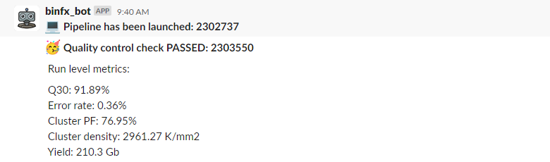
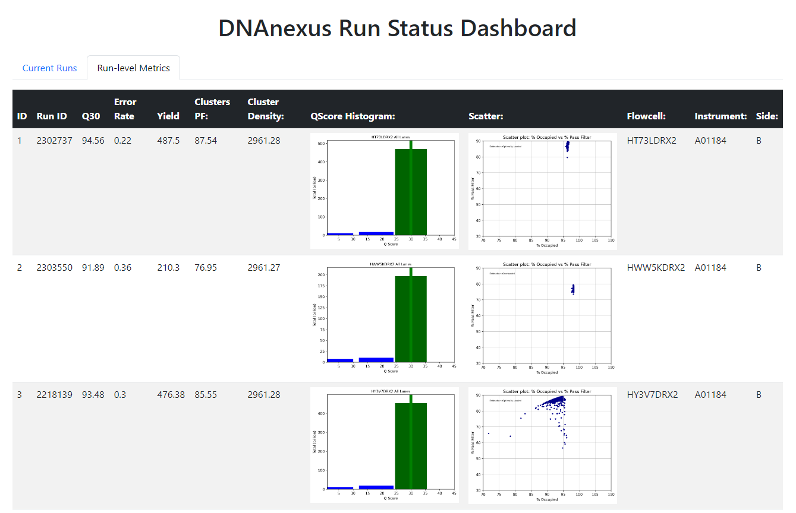
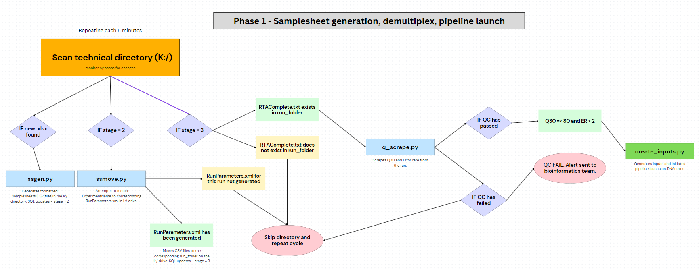
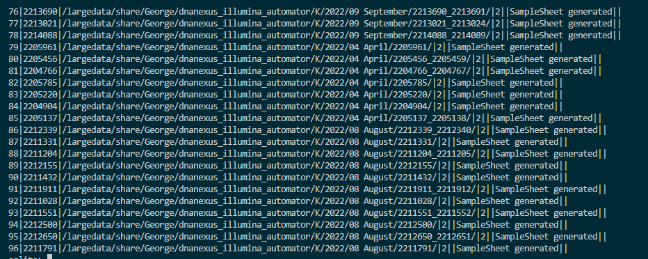

# dnanexus_illumina_automator

## Description
This repository contains a collection of Python scripts designed to automate the processing of DNA sequencing data. The pipeline polls a technical directory for changes, generates SampleSheets, checks for completion of Real-Time Analysis (RTA), and launches a pipeline via a Python script. It interacts with a SQLite database to track the progress of each run folder through the pipeline and scrapes the DNAnexus API to monitor the status of demultiplexing and analysis. It also features a Slack bot integration that posts updates to a specified channel as each stage progresses.




## Features
- Monitor a technical directory for changes
- Generate and move SampleSheets to the corresponding run folders
- Check for completion of Real-Time Analysis (RTA)
- Launch a pipeline via a Python script
- Track the progress of each run folder through a SQLite database
- Scrape the DNAnexus API to monitor the status of demultiplexing and analysis
- Check if Q30 and error rate exceed a minimum threshold before launching the pipeline
- Generate Q-score histogram plot and scatter plot
- Serve a dashboard displaying run status and metrics using Flask
- Slack bot integration to post updates as each stage progresses

## Requirements
- Python 3.x
- Docker (for Docker deployment)
- Libraries: Flask, SQLite, xml, csv, DNAnexus, and other dependencies
- OPTIONAL: Slack

## Installation
1. Clone the repository: Clone the project's repository to your local machine by running the following command in your terminal or command prompt:
```
git clone https://gitlab.com/gdoy/dnanexus_illumina_automator.git
```
If you don't have Git installed, you can download the repository as a ZIP file and extract it.

2. Configure the config.yaml file with the appropriate directories and database information.

3. Install the required libraries.
```
pip install -r requirements.txt
```

## Docker Deployment

1. Before building the Docker image, make sure to set the DX_API_KEY and SLACK_BOT_TOKEN as an environment variable. This allows the script to securely access your DNAnexus and Slack API keys. You can set it by adding the following lines to your .bashrc or .bash_profile file:
```
export DX_API_KEY=your_api_key_here
export SLACK_BOT_TOKEN=your_slack_bot_api_here
```

2. Build the Docker image by running the following command from the root of your project directory:
```
docker build -t nexus_automator .
```

## Usage

1. Run a Docker container based on your newly created image:
```
docker run -p 5000:5000 -e DX_API_KEY=$DX_API_KEY -e SLACK_BOT_TOKEN=$SLACK_BOT_TOKEN nexus_automator
```

2. Access the dashboard by navigating to http://localhost:5000 in your web browser.

## Scripts Description

- monitor.py: Monitors a technical directory for changes, generates SampleSheets, checks for completion of RTA, and launches a pipeline via a Python script.
- q_scrape.py: Checks if Q30 and error rate exceed a minimum threshold before launching the pipeline, extracts data from InterOp files, parses XML files, updates the SQLite database, and generates plots.
- ssgen.py: Moves samplesheets to their corresponding run folder based on RunParameters.xml and generates correctly formatted samplesheets.
- ssmove.py: Moves csv files to the output directory based on a search string that matches the ExperimentName in RunParameters.xml.
- dashboard.py: Defines a Flask web application that serves lsa dashboard page displaying run status and metrics retrieved from the SQLite database.

## Workflow


## Contributors
George Doyle (developer)

## License
The software is provided "as is" without warranty of any kind, either express or implied, including but not limited to the warranties of merchantability, fitness for a particular purpose, and noninfringement.

By using this project, you agree to the terms of the [MIT License](https://opensource.org/licenses/MIT).

## Changelog
- 1.01 (28/03/2023) - Script now dependent on SQLite checks. Flask dashboard added. DNAnexus polling for demultiplex completion.
- 1.02 (25/04/2023) - Slackbot integration to provide real-time updates on run status.

## Testing
### 2022
- SampleSheet generation: 96 somatic runs detected.

